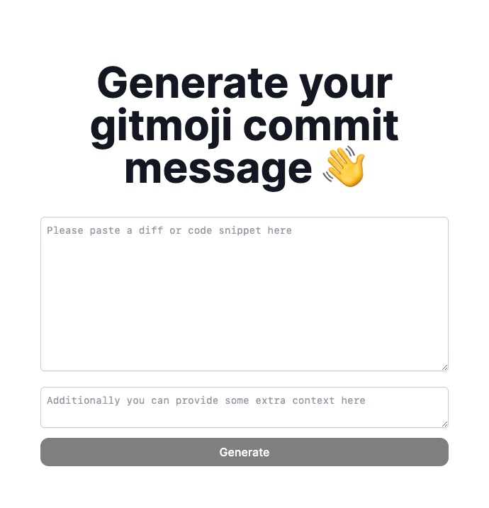

# genmoji

[Genmoji](https://genmoji.xyz) is a tool that uses the chatGPT API to generate commit messages from code snippets or `git diff`. With [Genmoji](https://genmoji.xyz), developers can easily create informative and concise commit messages, using the [gitmoji](https://gitmoji.dev) standard, without spending time and effort writing them themselves.

Check it out [here](https://genmoji.xyz)!

## Usage

Using Genmoji is as easy as providing a `git diff` or code snippet and pressing the `Generate` button. It will attempt to derive a fitting commit message from the context and code provided.

### Optional additional context

You can nudge the model into providing a better suitable gitmoji or message by providing some additional context. It is completely optional and doesn't have to be thorough. It can even be a single word.

A simple example can be that when you see an incorrect gitmoji being used, you can nudge it in the correct direction by typing an important keyword like `documentation` which will then guide it into using `:memo:` as the correct gitmoji.
