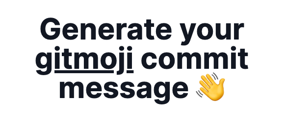

# genmoji.xyz

<p align="center">


[Genmoji](https://genmoji.xyz) is a [website](https://genmoji.xyz) that uses the ChatGPT API to generate commit messages from code snippets or `git diff`. With [Genmoji](https://genmoji.xyz), developers can easily create informative and concise commit messages, using the [gitmoji](https://gitmoji.dev) standard, without spending time and effort writing them themselves.

## Usage

Using Genmoji is as easy as providing a `git diff` or code snippet and pressing the `Generate` button. It will attempt to derive a fitting commit message from the context and code provided.

Check the tool out [here](https://genmoji.xyz) or go to https://genmoji.xyz.

### Optional additional context

You can nudge the model into providing a better suitable gitmoji or message by providing some additional context. It is completely optional and doesn't have to be thorough. It can even be a single word.

A simple example can be that when you see an incorrect gitmoji being used, you can nudge it in the correct direction by typing an important keyword like `documentation` which will then guide it into using `:memo:` as the correct gitmoji.

### CLI

There is also a CLI version of Genmoji available. It can be used to generate commit messages from your staged changes.

1. Download the latest binary from the [releases](https://github.com/segersniels/genmoji/releases/tag/latest) page for your system
2. Rename the binary to `genmoji`
3. Copy the binary to a location in your `$PATH`

```bash
$ genmoji -h

genmoji
Version: "x.x.x"

USAGE:
  genmoji [OPTIONS]

COMMANDS:
  generate   Generate a commit message based on the current staged changes
  commit     Generate a commit message & commit for your staged changes

OPTIONS:
      --model <VALUE>   OpenAI model to use (default: gpt-4-turbo-preview)
  -h, --help            Prints help information
```
